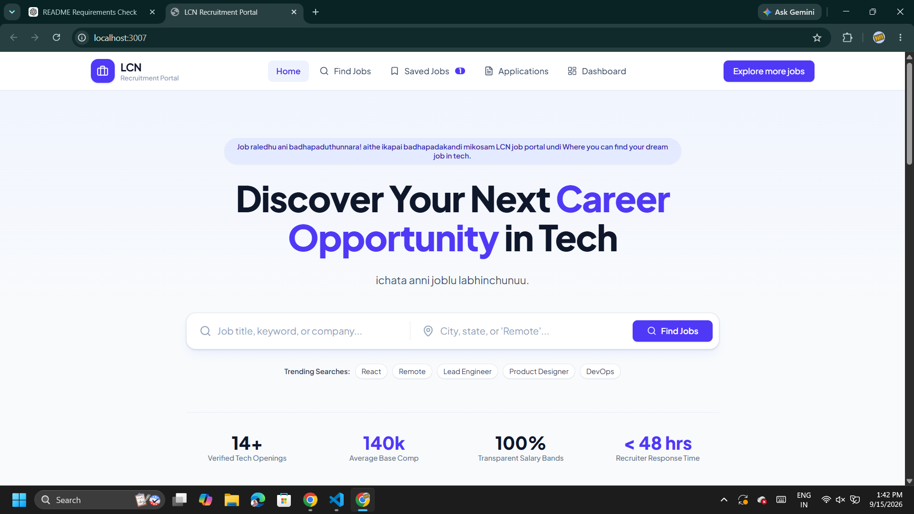
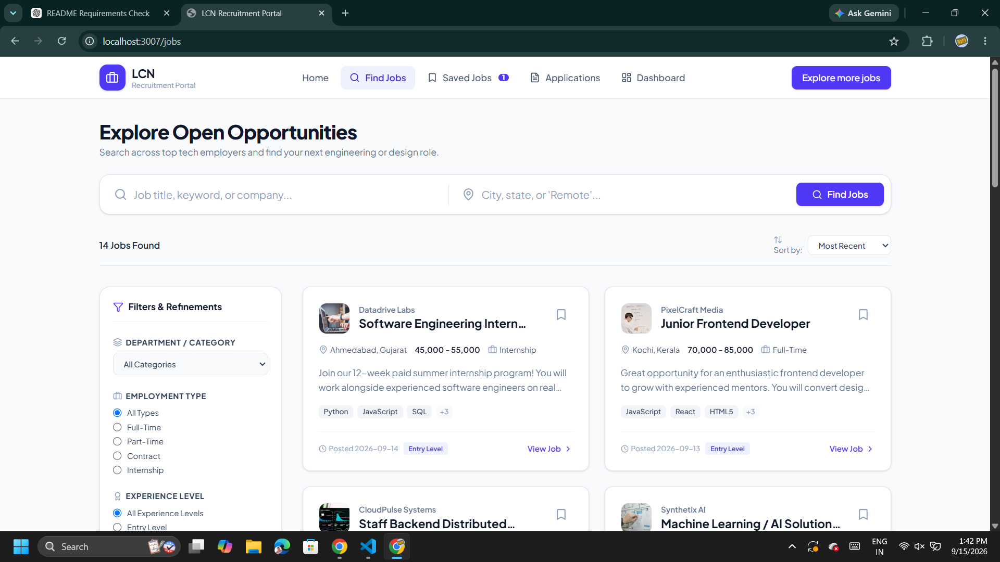
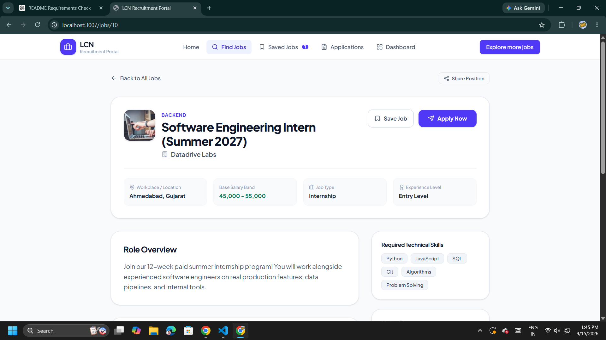
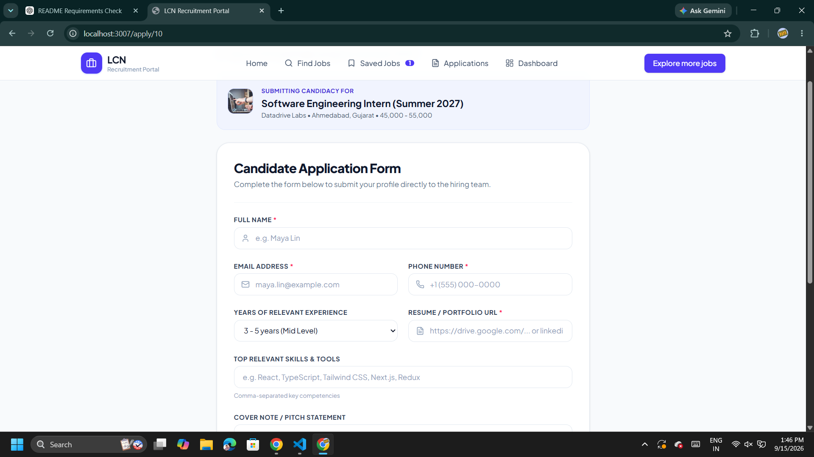
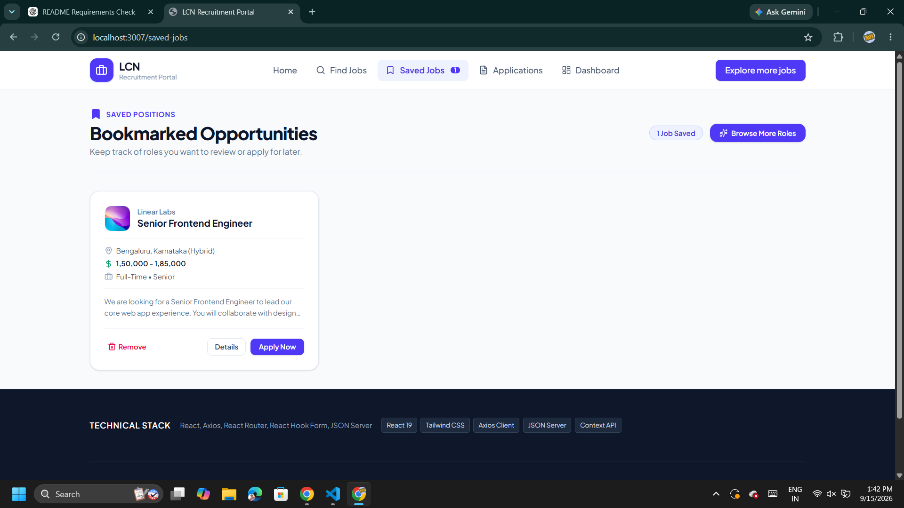
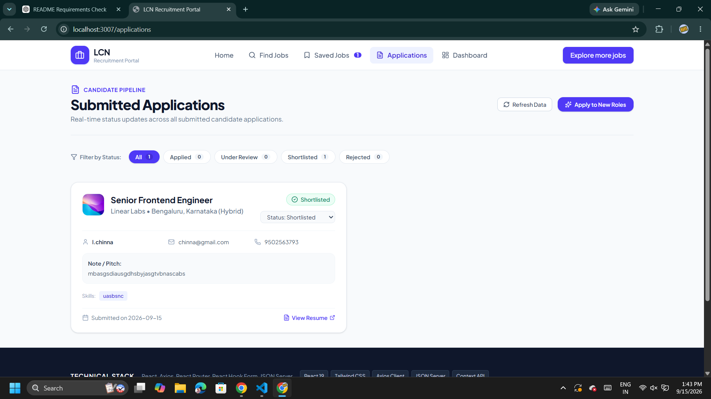
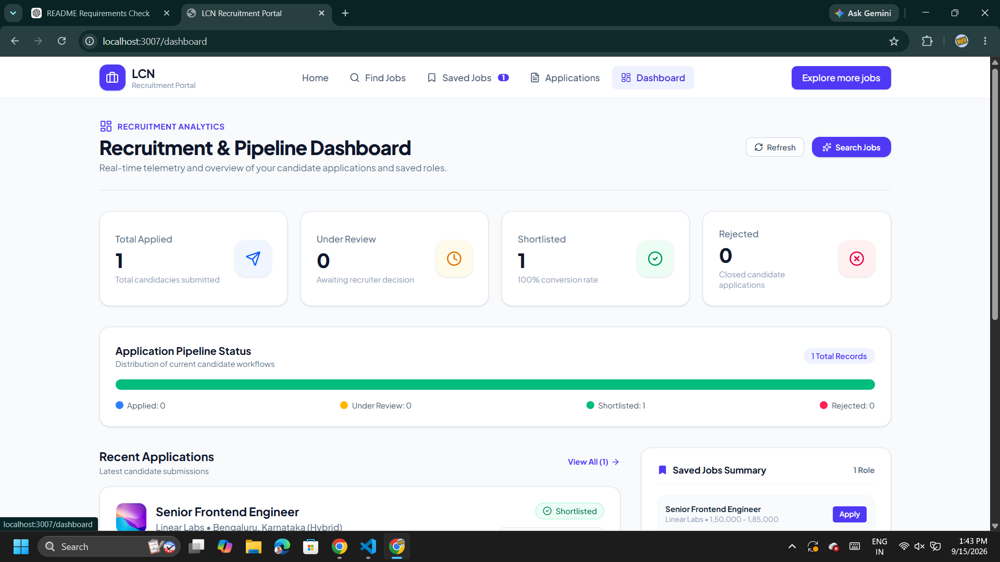

# LCN Recruitment Portal

LCN Recruitment Portal is a responsive job search and recruitment management application built with React and Vite. It supports job discovery, filtering, bookmarking, applications, recruitment status tracking, analytics, and a local REST-style mock backend.

## Features

- Search jobs by keyword and location.
- Filter by category, employment type, experience level, and minimum salary.
- Sort jobs by newest, highest salary, or lowest salary.
- View job descriptions, requirements, benefits, skills, Indian locations, and salary bands.
- Display salaries with Indian comma grouping and no currency symbols, for example `1,50,000 - 1,85,000`.
- Save and remove bookmarked jobs with shared state and local persistence.
- Submit validated applications with React Hook Form.
- Track applications by `Applied`, `Under Review`, `Shortlisted`, and `Rejected` status.
- Update application statuses from the applications page and dashboard.
- Delete rejected applications after confirmation.
- View recruitment metrics, pipeline counts, and recent applications on the dashboard.
- Use loading, error, empty, and retry states across data-driven screens.
- Refresh application routes without receiving raw API JSON.
- Use a compact footer technical-stack summary and educational disclaimer.

## Technology

- React 19
- Vite 6
- React Router
- Tailwind CSS
- Axios
- React Hook Form
- Lucide React
- JSON Server-compatible mock API powered by Vite middleware

## Project Structure

```text
jprms/
├── src/
│   ├── api/
│   │   ├── axiosClient.js              # Centralized Axios instance with base URL & error interceptor
│   │   ├── jobsApi.js                  # getJobs(params), getJobById(id)
│   │   ├── applicationsApi.js          # getApplications(), createApplication(), updateApplicationStatus()
│   │   └── savedJobsApi.js             # getSavedJobs(), saveJob(), removeSavedJob()
│   │
│   ├── components/
│   │   ├── layout/
│   │   │   ├── Navbar.jsx              # Responsive sticky nav with active link indicators & badges
│   │   │   └── Footer.jsx              # Portal footer with links, categories & tech stack info
│   │   │
│   │   ├── common/
│   │   │   ├── Button.jsx               # Reusable button with variants, sizes & loading states
│   │   │   ├── StatusBadge.jsx          # Dynamic status badge with color tokens
│   │   │   ├── LoadingState.jsx         # Presentational loading spinner & skeleton views
│   │   │   ├── ErrorState.jsx           # Error banner with retry trigger
│   │   │   └── EmptyState.jsx           # Empty result message with call-to-action
│   │   │
│   │   ├── jobs/
│   │   │   ├── JobCard.jsx              # Card showing company, salary, tags, save toggle & link
│   │   │   ├── CategoryCard.jsx         # Department card routing to /jobs?category=...
│   │   │   ├── SearchBar.jsx            # Controlled keyword and location search
│   │   │   └── FilterPanel.jsx          # Controlled filters (type, exp, category, salary, remote)
│   │   │
│   │   └── dashboard/
│   │       ├── DashboardCard.jsx        # Metrics KPI card component
│   │       └── ApplicationCard.jsx      # Application card with candidate details & status updater
│   │
│   ├── pages/
│   │   ├── Home.jsx                     # Landing page with hero, search, categories & featured roles
│   │   ├── JobsListing.jsx              # Jobs listing with URL query parameter synchronization
│   │   ├── JobDetails.jsx               # Single job view with full requirements & perks
│   │   ├── ApplyJob.jsx                 # React Hook Form application submission
│   │   ├── SavedJobs.jsx                # Bookmarked jobs management
│   │   ├── MyApplications.jsx           # Joined applications list with status filtering
│   │   ├── Dashboard.jsx                # Analytics, funnel metrics & recent submissions
│   │   └── NotFound.jsx                 # 404 fallback page
│   │
│   ├── context/
│   │   └── SavedJobsContext.jsx          # Global saved jobs state & persistence
│   │
│   ├── hooks/
│   │   └── useFetch.js                  # Reusable async data fetching hook
│   │
│   ├── App.jsx                           # Route definitions & shared layout shell
│   ├── main.jsx                          # React root entry point with BrowserRouter
│   └── index.css                         # Tailwind CSS imports and base styles
│
├── screenshots/                          # Application screenshots
│   ├── homepage.png                      # Home page
│   ├── jobs.png                          # Job search & filtering
│   ├── job_details.png                   # Job details page
│   ├── apply_job.png                     # Job application form
│   ├── saved_jobs.png                    # Saved jobs page
│   ├── applications.png                  # Application tracking page
│   └── dashboard.png                     # Recruitment analytics dashboard
│
├── db.json                               # Seed REST API database (jobs, applications, savedJobs)
├── index.html                            # HTML entry point with Plus Jakarta Sans typography
├── package.json                          # Project dependencies and run scripts
├── vite.config.ts                        # Vite config with integrated JSON mock server plugin
├── .env.example                          # Environment variable template
└── README.md                             # Documentation & setup instructions
```

## Getting Started

### Install dependencies

```bash
npm install
```

### Start the application

```bash
npm run dev
```

The development server uses port `3000` by default. If that port is already occupied, Vite automatically selects the next available port and prints the URL in the terminal.

The Vite configuration includes the local mock API middleware, so a separate backend is normally not required.

### Optional standalone JSON Server

```bash
npm run server
```

The standalone API runs on `http://localhost:5000`.

## Available Scripts

| Command | Description |
|---|---|
| `npm run dev` | Start the Vite development server |
| `npm run build` | Create a production build in `dist/` |
| `npm run preview` | Preview the production build locally |
| `npm run server` | Start JSON Server on port 5000 |
| `npm run lint` | Run the TypeScript compiler check |
| `npm run clean` | Remove generated build/server files |

## Routes

| Route | Description |
|---|---|
| `/` | Home page with search, categories, and featured jobs |
| `/jobs` | Searchable and filterable job directory |
| `/jobs/:id` | Detailed job information and actions |
| `/apply/:id` | Validated application form |
| `/saved-jobs` | Saved job list |
| `/applications` | Application tracking and status management |
| `/dashboard` | Recruitment analytics and recent applications |

## API Operations

- `GET /jobs`
- `GET /jobs/:id`
- `GET /applications`
- `POST /applications`
- `PATCH /applications/:id`
- `DELETE /applications/:id`
- `GET /savedJobs`
- `POST /savedJobs`
- `DELETE /savedJobs/:id`

Application deletion is exposed in the UI only for applications whose status is `Rejected`.

## Screenshots

### 1. Home Page



### 2. Jobs Search and Filtering



### 3. Job Details



### 4. Job Application



### 5. Saved Jobs



### 6. Application Tracking



### 7. Recruitment Dashboard



## GitHub

Repository: https://github.com/chinnamnaidu592/Job-Recruitement-Management-System

To save and publish future changes:

```bash
git add .
git commit -m "Describe your changes"
git push
```

## License

MIT License. This project is suitable for educational and commercial recruitment-management use.

## Disclaimer

This website is developed solely for educational and learning purposes. Content featured in regional languages is intended purely for entertainment.
